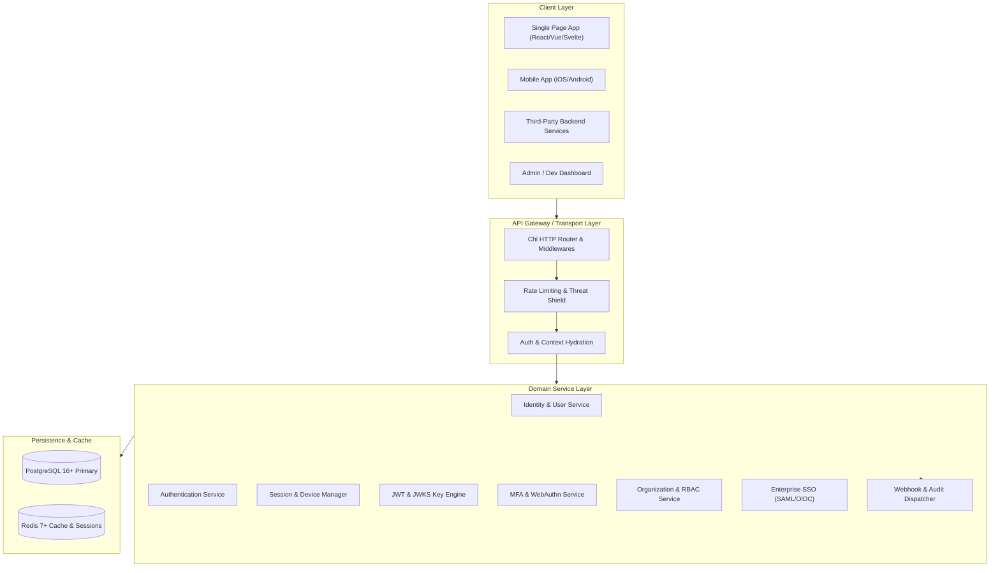
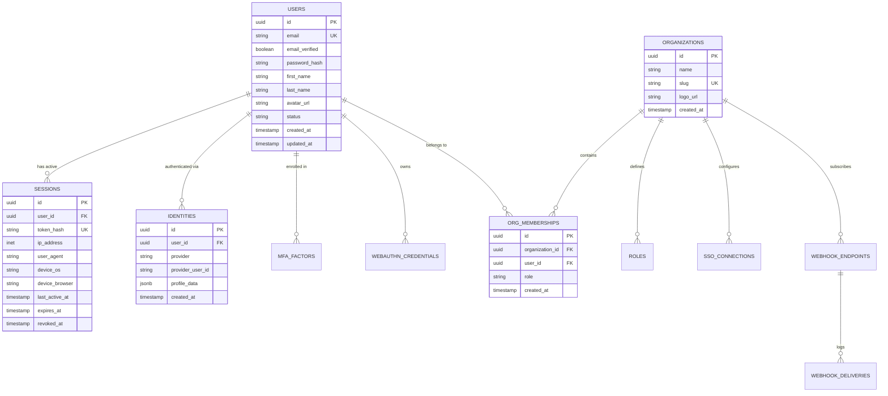

# System Architecture & Technical Design

This document details the architectural blueprints, design patterns, security rules, and code organization conventions used throughout the Go Auth Platform.

---

## 🏗 High-Level Architecture

The system is designed as a modular, API-first monolith in early stages (v1-v6), transitioning smoothly into a distributed-ready, multi-tenant authentication engine (v7-v12).



---

## 📁 Recommended Go Project Layout

The project follows standard Go package organization with Clean Architecture principles:

```
auth/
├── cmd/
│   ├── server/               # Main API server binary entrypoint
│   │   └── main.go
│   ├── worker/               # Background task consumer (webhooks, email queue, cleanups)
│   │   └── main.go
│   └── cli/                  # Admin & migration CLI tools
│       └── main.go
├── internal/
│   ├── domain/               # Pure domain models, interfaces, error definitions
│   │   ├── user.go
│   │   ├── session.go
│   │   ├── organization.go
│   │   └── errors.go
│   ├── auth/                 # Authentication core business logic
│   │   ├── password.go       # Argon2id hashing
│   │   ├── service.go
│   │   ├── totp.go
│   │   ├── webauthn.go
│   │   └── saml.go
│   ├── session/              # Session management and validation
│   ├── token/                # JWT generation, verification, and JWKS rotation
│   ├── org/                  # Multi-tenancy and RBAC logic
│   ├── webhook/              # Webhook dispatching with exponential backoff
│   ├── audit/                # Audit logging service
│   ├── mailer/               # Email templating & dispatching (SMTP, Resend, SES)
│   ├── database/             # Postgres connection & generated sqlc models
│   │   ├── queries/          # Raw SQL queries for sqlc
│   │   ├── migrations/       # Goose or Golang-Migrate SQL files
│   │   └── db.go
│   ├── redis/                # Redis client and key management
│   ├── http/                 # Transport layer: HTTP handlers & router
│   │   ├── router.go
│   │   ├── middleware/       # CORS, Logging, RateLimit, Auth, Tenant
│   │   ├── v1/               # API version 1 handlers
│   │   │   ├── auth_handler.go
│   │   │   ├── user_handler.go
│   │   │   ├── session_handler.go
│   │   │   ├── org_handler.go
│   │   │   └── webhook_handler.go
│   │   └── response/         # Standard JSON response & RFC 7807 problem helpers
│   └── config/               # Environment configuration (viper or envconfig)
├── pkg/
│   ├── sdk/                  # Exportable Go SDK client for third-party backend integration
│   └── crypto/               # Reusable cryptographic helper primitives
├── docs/                     # Documentation & specifications
├── scripts/                  # Development setup & seed scripts
├── docker-compose.yml
├── Makefile
├── go.mod
└── go.sum
```

---

## 🔒 Cryptographic & Security Baseline

| Area | Algorithm / Standard | Specification |
| :--- | :--- | :--- |
| **Password Hashing** | Argon2id | Memory: 64MB (`65536` KiB), Time: 3 passes, Threads: 4, Salt: 16 bytes CSPRNG, Hash: 32 bytes |
| **Session Identifiers** | CSPRNG Opaque Strings | 256 bits (32 bytes) hex/base64url encoded. Stored as SHA-256 hash in DB to prevent DB-leak hijacking. |
| **JWT Access Tokens** | RS256 / Ed25519 (EdDSA) | Asymmetric signatures. Keys rotated every 30-90 days with `kid` tracking. |
| **String Comparison** | Constant-Time | `subtle.ConstantTimeCompare` across all secret, token, and hash verifications. |
| **Cookie Security** | `__Host-` prefixed cookies | `HttpOnly=true; Secure=true; SameSite=Lax (or Strict); Path=/` |
| **CSRF Defense** | Double Submit Cookie / Custom Headers | Required `X-Requested-With` or `Origin` validation for state-changing endpoints. |
| **Webhook Signatures**| HMAC-SHA256 | `v1,t=<timestamp>,v1=<signature>` header format to prevent replay attacks. |

---

## 🗄 Core Data Models & Relations (Entity Relationship)



---

## 🚦 API Error Format Standards (RFC 7807)

All non-2xx responses adhere strictly to the RFC 7807 Problem Details format:

```json
{
  "type": "https://api.yourdomain.com/errors/invalid_credentials",
  "title": "Invalid Credentials",
  "status": 401,
  "detail": "The email or password you entered is incorrect.",
  "code": "INVALID_CREDENTIALS",
  "timestamp": "2026-09-14T15:45:00Z",
  "instance": "/v1/auth/sign-in",
  "invalid_params": [
    {
      "name": "password",
      "reason": "Password does not match records"
    }
  ]
}
```

