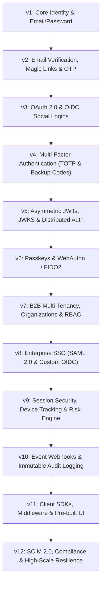

# Auth Platform (Clerk-like in Go) — Master Roadmap & Implementation Plan

Welcome to the comprehensive 12-version implementation blueprint for building a production-grade, developer-first Authentication and User Identity platform in Go (architecturally inspired by Clerk, WorkOS, and Auth0).

---

## 🧭 Roadmap Overview

The roadmap spans 12 structured versions, designed incrementally so that every version produces a secure, fully functional, and testable milestone that builds naturally upon previous layers without requiring disruptive rewrites.



---

## 📊 Version Summary Matrix

| Version | Focus Area | Core Features | Key Go Libraries / Concepts |
| :--- | :--- | :--- | :--- |
| **v1** | **Core Identity & Password Auth** | User signup/login, Argon2id hashing, opaque session tokens, session cookies, user profile CRUD, robust error handling. | `golang.org/x/crypto/argon2`, `chi` or `echo`, `pgx/v5`, database migrations. |
| **v2** | **Passwordless & Email Verification** | Email verification flows, time-limited magic links, secure 6-digit numeric OTPs, transaction mailer queue, anti-abuse rate limits. | `crypto/rand`, SMTP / Resend / AWS SES integration, Token bucket rate limiter. |
| **v3** | **OAuth 2.0 & Social Identity** | Google, GitHub, Apple, Discord logins, state/PKCE verification, multi-identity account linking and unlinking. | `golang.org/x/oauth2`, PKCE generation, identity provider interface abstraction. |
| **v4** | **Multi-Factor Auth (MFA)** | TOTP authenticator apps (RFC 6238), QR code provisioning, cryptographically secure recovery backup codes, step-up auth challenge flow. | `pquerna/otp`, constant-time comparison, MFA enrollment state machine. |
| **v5** | **Distributed Auth & JWKS** | Asymmetric key generation (RS256 / EdDSA), Key rotation engine, `/.well-known/jwks.json`, stateless microservice token validation. | `lestrrat-go/jwx/v2` or `golang-jwt/jwt/v5`, key rotation cron. |
| **v6** | **Passkeys & WebAuthn** | FIDO2 / WebAuthn passwordless authentication, FaceID/TouchID/YubiKey support, credential registration and assertion ceremonies. | `go-webauthn/webauthn`, credential store, attestation verification. |
| **v7** | **B2B Multi-Tenancy & RBAC** | Organizations, workspaces, team member invitations, custom roles, granular permissions, multi-tenant data isolation. | Policy engine / RBAC evaluator, hierarchical context middleware. |
| **v8** | **Enterprise SSO (SAML & OIDC)** | Enterprise identity federation, SAML 2.0 SP metadata and assertion consumer, custom enterprise OIDC connections, JIT provisioning. | `crewjam/saml`, XML signature validation, domain routing engine. |
| **v9** | **Device Security & Anomaly Detection** | Active session inspector, remote session revocation, User-Agent device parsing, MaxMind Geo-IP lookup, HIBP breached password check. | `mssola/user_agent`, `oschwald/geoip2-golang`, Redis sliding window rate limiter. |
| **v10** | **Webhooks & Audit Logs** | Event-driven architecture, webhook delivery worker with HMAC-SHA256 signatures and exponential backoff retry, immutable audit trails. | Transactional outbox pattern, Asynq / Redis queue, event dispatcher. |
| **v11** | **SDKs & Pre-built Frontend UI** | Go Backend SDK, TypeScript/React Headless & Pre-built UI components (`<SignIn />`, `<UserProfile />`), Next.js / Express middlewares. | React/TypeScript component library, embeddable JS script, Go SDK. |
| **v12** | **Enterprise SCIM & Production Scale** | SCIM 2.0 automated employee provisioning/deprovisioning (Okta/Azure AD), multi-region read replicas, Prometheus/OTel telemetry, GDPR export/delete. | SCIM RFC 7644 schemas, OpenTelemetry, Prometheus metrics, distributed tracing. |

---

## 🛠 Recommended Technology Stack

- **Core Language**: Go 1.22+ (utilizing modern routing enhancements, typed context, structured logging via `log/slog`)
- **HTTP Routing / Framework**: `chi` (minimal, idiomatic, standard `net/http` compatible)
- **Database**: PostgreSQL 16+ (JSONB, strict constraints, row-level security readiness)
- **Database Driver & Query Tool**: `pgx/v5` with `sqlc` for compile-time type-safe SQL queries
- **Caching & Ephemeral Storage**: Redis 7+ (session caches, rate limiting, OTP storage, Pub/Sub)
- **Cryptographic Foundations**:
  - Passwords: **Argon2id** (memory: 64MB, iterations: 3, parallelism: 4)
  - Random Tokens: `crypto/rand` (256-bit CSPRNG)
  - Asymmetric Keys: **Ed25519** / **RS256** for JWT signatures
- **Background Worker**: Transactional Outbox Pattern + Redis-backed `asynq` or native Go worker pools
- **Observability**: `log/slog` (structured logging), Prometheus metrics, OpenTelemetry tracing

---

## 📂 Documentation Directory Structure

The detailed specification for each version is organized as follows:

```
docs/
├── ROADMAP.md                                  # Master roadmap and version comparison (this file)
├── ARCHITECTURE.md                             # Architectural patterns, domain design, security guidelines
└── versions/
    ├── v01-core-identity-email-password.md     # v1 Specification
    ├── v02-magic-links-otp-email-verification.md # v2 Specification
    ├── v03-oauth2-social-logins.md             # v3 Specification
    ├── v04-mfa-totp-backup-codes.md            # v4 Specification
    ├── v05-jwt-jwks-distributed-auth.md        # v5 Specification
    ├── v06-passkeys-webauthn.md                # v6 Specification
    ├── v07-multi-tenancy-organizations-rbac.md # v7 Specification
    ├── v08-enterprise-sso-saml-oidc.md         # v8 Specification
    ├── v09-session-device-security-risk.md     # v9 Specification
    ├── v10-webhooks-audit-logs.md              # v10 Specification
    ├── v11-developer-experience-sdks-ui.md     # v11 Specification
    └── v12-scim-compliance-scale.md            # v12 Specification
```

---

## 🎯 Engineering Principles

1. **Security-First Default**: Constant-time string comparisons, strict parameter validation, parameterized queries, automated secret zeroing, and least-privilege scoping.
2. **Clean Domain-Driven Architecture**: Separation of HTTP transport handlers, business domain services, and database persistence layers.
3. **Additive Schema Evolution**: Migrations are strictly forward-compatible and non-destructive.
4. **Comprehensive API Error Contracts**: Standardized RFC 7807 problem details with human-readable error messages and machine-readable error codes.
5. **Zero External Vendor Lock-in**: Architecture relies on standard cryptographic protocols (OAuth2, OIDC, WebAuthn, SAML, SCIM, TOTP) rather than proprietary SaaS APIs.

